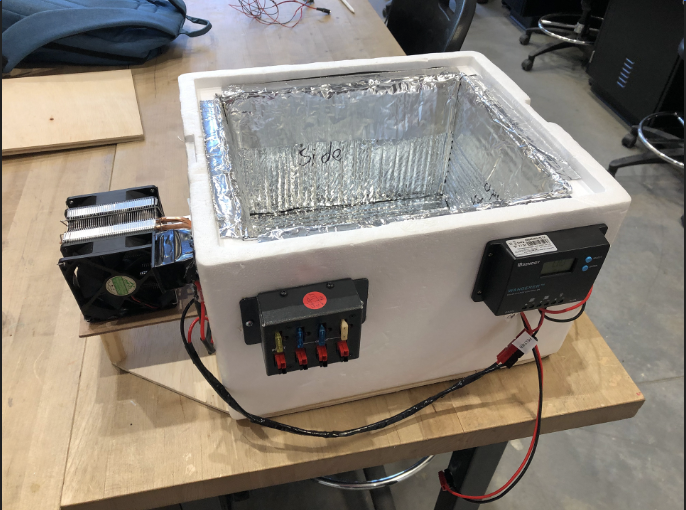
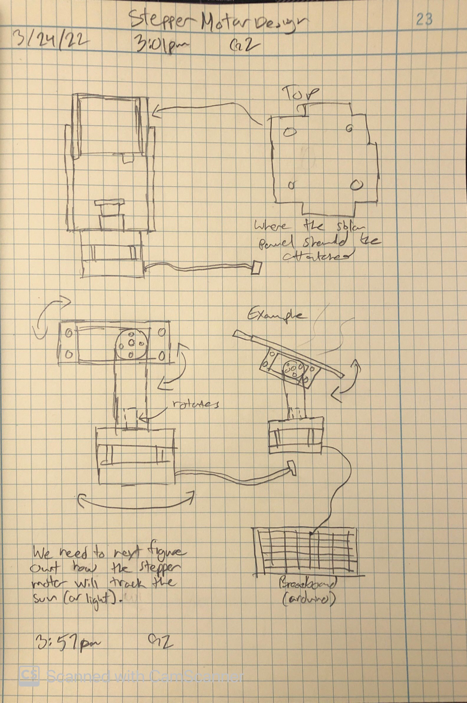
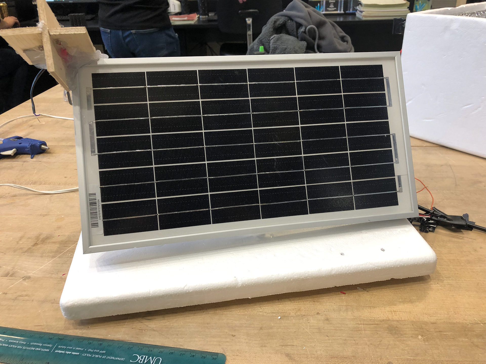

# Solar-Powered Cooler (with Solar Tracking Prototype)

A portable cooler powered by a solar panel + battery system. The primary goal was achieving reliable cooling from solar energy, with a stretch goal of adding a solar tracking mechanism (prototype attempted, not fully completed due to time/budget constraints).

> **Highlight:** Team earned a **Best Presentation Award** for clearly communicating design, trade-offs, and results.

### Final Build

## Project Goals

- **Core Functionality:** Solar panel powers the system and charges a battery bank to run cooling hardware.
- **Reliability:** Stable electrical integration (wiring, power delivery, safety).
- **Stretch Goal:** Implement a **solar tracking system** to improve panel efficiency.

## System Overview

### High-Level Architecture
**Solar Panel → Charge Controller → Battery → Loads (cooling system + control electronics)**

## Electrical Notes (What mattered)

- **Power budgeting:** estimated load current, runtime targets, and solar charging capability.
- **Safety:** fuse placement, proper wire gauge, strain relief, connector choice.
- **Integration:** clean routing + serviceable layout for debugging and iteration.

## Mechanical / Enclosure Notes

- **Insulation strategy:** foam body + reflective lining to reduce heat gain.
- **Mounting + packaging:** secured electronics externally for access and airflow.
- **Iterative fit:** adjusted clearances/fastener placement to avoid rework.

## Solar Tracking (Prototype Attempt)

We attempted a solar tracking mechanism to maintain panel alignment with the sun, but it remained incomplete due to:
- limited time and budget
- mechanical complexity of building a reliable tracking mechanism
- prioritizing core cooler functionality over advanced features

What we learned:
- importance of **scope control**
- designing for **testability** and incremental milestones
- balancing ambition vs. reliability under constraints

## What Went Well

- Built a **functional solar-powered cooler** achieving core objectives.
- Created **detailed 3D models and technical drawings** to guide fabrication.
- Strong communication and planning during presentations, resulting in a **Best Presentation Award**.
  
## What Didn’t Go Well (and what I’d change)

- Solar tracking was over-scoped for the remaining timeline.
- Time management became challenging across design + build + integration.
- Next time: prototype the tracker earlier, simplify mechanics, and define a minimum viable tracking design first.

## Skills Demonstrated / Learned

### Technical / Engineering
- **CAD + technical drawings:** created precise models/drawings to translate concepts into a build
- **Electrical integration:** wiring, power distribution, connectors, troubleshooting
- **Systems thinking:** balancing power generation, storage, and load requirements
- **Iterative design:** prototype → test → revise based on real constraints

### Execution / Leadership
- **Project management:** task delegation, scheduling, and milestone control
- **Problem-solving under constraints:** traded advanced features for core reliability
- **Communication:** explaining complex concepts clearly to a broad audience

## How to Reproduce / Improve

1. Build insulated enclosure (see CAD/drawings)
2. Install power system: panel → controller → battery
3. Add fused distribution to loads
4. Validate voltages/currents under load
5. Measure runtime + cooling performance
6. (Optional) add simplified solar tracking module

## Future Improvements

- Add instrumentation (voltage/current logging) for efficiency tracking
- Improve weather resistance + cable management
- Rebuild tracker as a smaller MVP (single-axis, simpler linkage)
- Optimize insulation + airflow around electronics

## License
See `LICENSE`.
